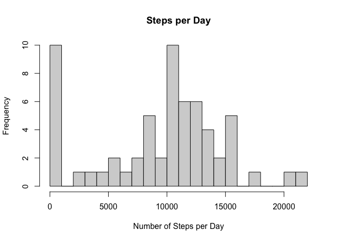
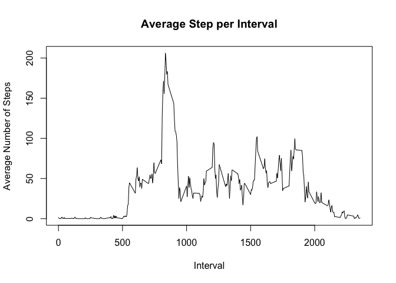
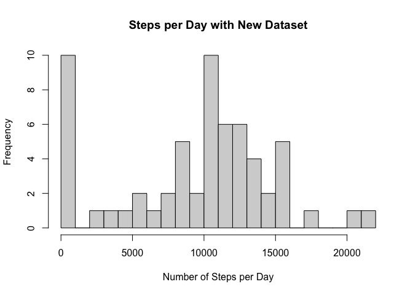
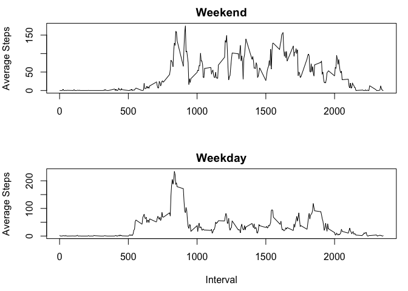

Loading and preprocessing the data
----------------------------------

The first part of the assignment starts by loading the data and storing
it in a variable called ‘data’. The date column is converted to POSIXlt
format from its original character class.

    setwd("~/Desktop/Data Science Class/datasciencecoursera")
    data<-read.csv('activity.csv')
    data$date<-strptime(data$date,'%Y-%m-%d')

What is mean total number of steps taken per day?
-------------------------------------------------

In the next part of the assignment, we will use the tapply function to
calculate the total number of steps taken for each date. A histogram is
generated and the mean and median is reported via the summary function.

    step_per_day<-tapply(data$steps,as.factor(data$date),sum,na.rm=TRUE)
    hist(step_per_day,breaks=20,xlab='Number of Steps per Day',
         main='Steps per Day')

    summary(step_per_day)

    ##    Min. 1st Qu.  Median    Mean 3rd Qu.    Max. 
    ##       0    6778   10395    9354   12811   21194

What is the average daily activity pattern?
-------------------------------------------

To calculate the average number of steps per interval, we again use the
tapply function to determine the average number of steps for each
interval factor.

    step_per_interval<-tapply(data$steps,as.factor(data$interval),mean,na.rm=TRUE)
    plot(unique(data$interval),step_per_interval,type='l',xlab='Interval',ylab='Average Number of Steps',main='Average Step per Interval')

Using the which function, we can determine the index at which the
maxiumum average number of steps occur. In this case, we see that the
maximum occurs at the interval 835, corresponding to the line graph that
was generated above.

    index<-which(step_per_interval==max(step_per_interval))
    print(step_per_interval[index])

    ##      835 
    ## 206.1698

Imputing missing values
-----------------------

The following code is used to calculate the total number of NAs in the
dataset. We can see from the output that there are a total of 2304 NAs
in the steps column.

    sum(is.na(data$steps))

    ## [1] 2304

We will use a for loop to create a new dataset, data2, by filling in the
NAs in our dataset with the mean number of steps reported for that day.
A new variable, mean\_spd, is created with the tapply function that
contains the mean number of steps per day. If the value for a particular
day is NaN, we will replace the NAs in our dataset with the number 0.

    mean_spd<-tapply(data$steps,as.factor(data$date),mean,na.rm=TRUE)
    data2<-data.frame(steps=NULL,date=NULL,interval=NULL)
    for (i in 1:length(data$steps)){
         data2<-rbind(data2,data.frame(steps=data$steps[i],date=data$date[i],
                                      interval=data$interval[i]))
         if (is.na(data2$steps[i])) {
              data2$steps[i]<-mean_spd[data2$date[i]]
              if (is.na(data2$steps[i])){
                   data2$steps[i]<-0
              }
         }
    }

Next, we will make a histogram of the total number of steps taken per
day using our new dataset, data2.

    step_per_day2<-tapply(data2$steps,as.factor(data2$date),sum,na.rm=TRUE)
    hist(step_per_day2,breaks=20,xlab='Number of Steps per Day',
         main='Steps per Day with New Dataset')

    summary(step_per_day2)

    ##    Min. 1st Qu.  Median    Mean 3rd Qu.    Max. 
    ##       0    6778   10395    9354   12811   21194

The results show that replacing the NA values with the average number of
steps taken that day does not change the the mean and median for the
total number of steps taken each day. Upon closer inspection, all the
NAs in the original data is grouped together for a particular day.
Perhaps there would have been an alteration to the mean and median of
the dataset had the NAs been more randomly scattered.

Are there differences in activity patterns between weekdays and weekends?
-------------------------------------------------------------------------

The first step is to create a new factor in our dataset that classifies
the dates into either weekday or weekend. When then create a new
dataframe, data3, that contains the average number of steps for each
5-min interval for the weekday and weekend factors.

    weekday<-c('Monday','Tuesday','Wednesday','Thursday','Friday')
    data$Class <- factor(weekdays(data$date) %in% weekday,
                       levels=c(FALSE, TRUE), labels=c('Weekend', 'Weekday'))
    data3<-with(data,tapply(steps,list(interval,Class),mean,na.rm=TRUE))
    data3<-cbind(Interval=as.integer(rownames(data3)),data3);data3<-as.data.frame(data3)

Next, we will generate the plot using the base plot function.

    par(mfrow=c(2,1))
    par(mar=c(4.5, 4, 2, 1))
    plot(data3[,1],data3[,2],type='l',xlab='',ylab='Average Steps',main='Weekend')
    plot(data3[,1],data3[,3],type='l',xlab='Interval',ylab='Average Steps',main='Weekday')

